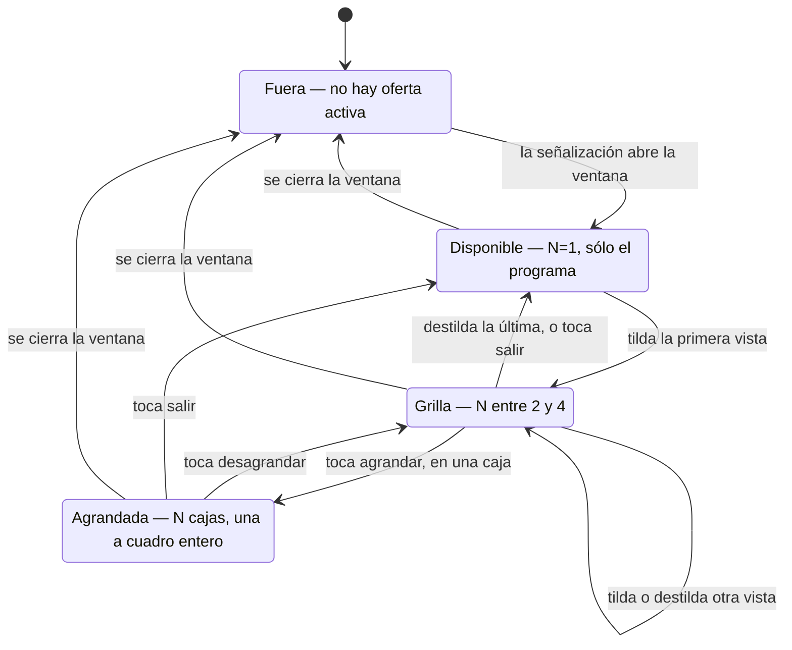

# Fase 11: el multi view que elige quien mira

> **Diseño acordado con Nicolás el 2026-09-11.** Es la etapa 1 del modo C del
> skill `create-project`: la exploración de la fase, con sus alternativas y sus
> descartes. El acuerdo sobre este documento es el evento que generó `PHASE.md`,
> `TASKS.md` y los ADR 0063 a 0072; de ahí en adelante el contrato de la fase es
> `PHASE.md` y este archivo queda como la procedencia, para quien venga después a
> preguntar por qué la fase terminó siendo así.

El proyecto tiene un tag que anuncia una experiencia concurrente y un
reproductor que la dibuja: el que publica declara el layout y el cliente lo
obedece. Esta fase agrega un segundo tag donde el que publica **ofrece un
catálogo** y quien mira **arma su propia composición**, que es una relación
distinta y no un layout más.

---

## Lo que entra como dato y no se discute acá

Es el pedido de Nicolás del 2026-09-11 y sus respuestas a las preguntas que ese
pedido dejó abiertas. Las partes que ya son decisiones suyas van citadas para que
nadie las reabra por costumbre.

**El tag nuevo anuncia otros contenidos, no un aviso.** *"el que publica el
contenido, el broadcaster, o sea la playlist, va a decir qué otros contenidos se
pueden ver en multi view"*.

**La diferencia con el aviso es de gobierno.** *"en los ads el proveedor del ad
controla cómo se ve el ad y punto. En cambio en el multi view lo que queremos es
poder decirle al usuario, che mirá, estos son los otros videos que se pueden ver,
y que el usuario pueda elegir cuál quiere ver"*.

**El contenido principal es una de las vistas.** Textual: *"el programa principal
SI cuenta como una de las vistas"*.

**El tope son cuatro cajas en pantalla.** *"dijimos por ahora máximo 4 así queda
un multiview de 2x2"*: el programa más tres vistas como máximo simultáneo.

**Los tres layouts están fijados y la escalera termina ahí.** *"si querés ver dos
contenidos queda side by side; si querés tres, dos arriba y uno abajo al medio; si
querés cuatro, una grilla de dos por dos. Y llegamos hasta ahí, porque la idea no
es matarnos sino hacer esta prueba de concepto"*.

**No hay un botón de entrar: hay un selector donde se van agregando videos.**
*"lo mejor va a ser replicar la experiencia de aws multiview donde el usuario va
agregando videos. En lugar de un botón enable multiview, lo que tenemos que hacer
es que cuando estemos en la ventana de multiview aparezca un botón tipo dropdown
(muy estético y lindo) que te deje ir seleccionando qué videos querés ver"*.

**Ese selector vive en la barra de controles del player.** *"tal vez tenemos que
hacer que los controles de agregar y quitar cámaras esté como un elemento que se
agrega en los controles del player, que es generalmente donde elegís audio,
volumen, fullscreen, y ahora también los videos que son parte del multiview"*.

**El anuncio de disponibilidad es un popup sutil sobre el video.** *"si el usuario
está viendo el contenido, aparezca algún tipo de popup sobre el video muy sutil
que diga multiview available una vez que entremos en la ventana de multiview,
para que el usuario sepa que ahora puede elegir qué videos agregar"*.

**Cada vista necesita un nombre en el asset list.** *"esto también hace que
tengamos que agregar algún name o descripción en el asset list para mostrar en
pantalla un nombre lindo respecto al video (ej: en la carrera de autos, si las
cámaras del multiview siguen a un competidor en particular, el nombre sería el
nombre del competidor)"*.

**Agrandar es foco completo, de imagen y de audio.** *"si un video pasa a full
pantalla entonces es el único que tiene que sonar: el botón de full pantalla es
full foco (video y audio)"*. Tocar una caja sigue siendo sólo el audio, que es el
gesto de la fase 06; el botón de agrandar es las dos cosas.

**Los botones de la caja aparecen con el gesto.** *"tiene que haber un botoncito
en cada uno de los videos, que solamente aparezca cuando vas con el mouse o cuando
tocás con el dedo, para agrandar uno"*, y *"tiene que haber un botoncito para
desagrandar y volver al tamaño que tenía naturalmente"*.

**La salida devuelve el contenido principal como venía.** *"un botón de salir del
multi view, que quiere decir poner simplemente el contenido original como venía,
el principal y listo, sin tocar nada de la cámara, del CC, del viewport"*.

**La demo de esta fase no es la de la carrera de autos.** *"La primera demo NO es
la demo de la carrera de autos... Vamos ahora a la funcionalidad: que esto
funcione, validar que la SDK tiene el comportamiento como lo describí... la idea
ahora es solamente que la SDK funcione con los dos tags: el que ya tenemos y este
nuevo"*.

**`projects/aws-multiview` dejó de ser una referencia opcional.** Nicolás pidió
replicar esa experiencia, así que lo que ahí está resuelto sobre la elección de
opciones es material de primera mano y este diseño lo cita por archivo y por
regla.

Y lo que ya está decidido en el proyecto y esta fase hereda sin reabrir: el
ADR 0003 (las dos capas y la costura entre ellas), el ADR 0004 (consumir la
herramienta de SVTA tal como emite), el ADR 0009 (la clase concurrente es hermana
y no extensión), el ADR 0015 (el límite del SDK y que los controles son de la
librería), el ADR 0022 (una demo es una carpeta que se levanta con `./run.sh`), y
los seis ADR del foco de audio de la fase 06 (0026 a 0031).

---

## El punto de partida, medido

Veinte hechos, del código de este proyecto y del de `aws-multiview`. Cada uno
decide algo de más abajo, y por eso están numerados.

### De este proyecto

1. **La clase de hoy es una constante y el mapeo a `kind` es un objeto de una
   entrada por clase.** `lib/signalling.js:15` define
   `CONCURRENT_CLASS = 'com.qualabs.hls.concurrentInterstitial'`,
   `lib/signalling.js:24` define
   `INTERSTITIAL_CLASS = 'com.apple.hls.interstitial'`, y `KIND_OF_CLASS`
   (línea 32) los traduce a `'concurrent'` e `'interstitial'`. `kindOfClass()`
   devuelve `null` para cualquier otra, y un Date Range que da `null` no es un
   rango del programa.

2. **El tag que la demo escribe hoy es este**, de
   `demo/compatibility-pair/scripts/senalizar-contenido.sh`:

   ```
   #EXT-X-DATERANGE:ID="AD-N-CONCURRENT",CLASS="com.qualabs.hls.concurrentInterstitial",
   START-DATE="...",X-ASSET-LIST="/signalling/asset-list-*.json",
   X-RESUME-OFFSET=0,X-SNAP="OUT,IN",X-RESTRICT="SKIP",PLANNED-DURATION=<largo>
   ```

   y al lado, con el mismo `START-DATE`, el de clase Apple que se queda el
   cliente de mercado (ADR 0007).

3. **El asset-list es el del Apéndice D.2 más un bloque nuestro.** `ASSETS[]`,
   cada asset con `URI` y `DURATION` obligatorios, y opcionalmente
   `X-AD-CREATIVE-SIGNALING` (`lib/signalling.js:133`, constante `BLOCK`) con
   `version`, `type: "slot"` y `payload[]`. Cada item del payload trae `type`,
   `start`, `duration` y `layout`, y el `layout` trae `primaryContent` y
   `assets[]`, cada uno con su `viewport` de cuatro porcentajes, su `zDepth` y su
   `volume`.

4. **El `viewport` es lo que el proveedor decide y el cliente obedece.** Son
   cuatro porcentajes de *inset* en el orden top, right, bottom, left
   (`parseViewport`, `lib/signalling.js:72`), y la conversión a píxeles es una
   resta (`boxToPixels`, `lib/renderer.js:267`). La T-03 la midió contra el
   modelo de la herramienta de SVTA con cero píxeles de diferencia en los quince
   elementos de los seis layouts.

5. **Lo que cruza la costura es dato plano y no tiene una palabra del
   transporte.** `docs/contrato-senalizacion-renderizado.md`: el proveedor es
   `activeAt(time) -> Experience[]` y `programRanges() -> {ranges, settled}`, y
   una `Experience` es `{id, itemId, type, startTime, duration, elements[]}` con
   `Element{id, primary, box, zDepth, volume, uri, mediaType}`. El `kind` del
   rango cruza; la clase de HLS nunca.

6. **`multiView` ya es un `type` tomado, y no por nosotros.** Es uno de los seis
   identificadores que emite la herramienta de SVTA, y el ADR 0012 lo mapea al
   Quad editorial de los cinco nombres del documento de requerimientos.
   `demo/compatibility-pair/signalling/asset-list-multiView.json` es el break 4
   del recorrido que se graba.

7. **Ese Quad ya es una grilla de 2x2 con el contenido primario adentro.** Sus
   cuatro `viewport` son `"0 50 50 0"` para el primario, `"0 0 50 50"`,
   `"50 50 0 0"` y `"50 0 0 50"` para los tres assets. Es exactamente la grilla
   de cuatro que pide esta fase, ya dibujada y ya grabada.

8. **La herramienta letterboxea el side by side en vez de deformar.** Su
   `squeezebackDoubleBox` declara el primario en `"25 50 25 0"` y el asset en
   `"25 0 25 50"`: dos cajas de 50 % por 50 % centradas verticalmente, con negro
   arriba y abajo. No usa las dos mitades de pantalla completa, y la razón se ve
   en el hecho 9.

9. **El primario se achica con un `transform` y un `transform` no respeta la
   relación de aspecto.** `movePrimary` (`lib/renderer.js:774`) calcula
   `sx = px.width / area.width` y `sy = px.height / area.height` y avisa cuando
   difieren más de 0,001, porque la imagen se deforma. El `object-fit: cover` del
   ADR 0013 no lo salva: un transform escala lo que `object-fit` ya dibujó. Una
   media pantalla de alto completo daría `sx = 0,5` y `sy = 1`, o sea el doble de
   ancho aparente.

10. **El navegador aguanta las cuatro cajas, y está medido.** La T-01 de la fase
    01 corrió 1, 2, 3, 4 y 5 elementos de video simultáneos a 1280x720 y 30 fps:
    los cinco reprodujeron a 29,8 fps con `rateVsWall` 0,996 y cero errores.
    Evidencia en
    `.project/phases/01-poc-web-hlsjs/tasks/T-01/m1-resultados.json`. La grilla
    de esta fase necesita cuatro.

11. **El foco de audio ya existe, es exclusivo, y tiene una sola puerta.**
    `setFocus` (`lib/renderer.js:866`) mueve el índice, el anillo amarillo de
    4 px (`FOCUS_RING_PX`, `FOCUS_RING_COLOUR`) y la mezcla, en una sola llamada.
    `effectiveVolumeOf` (línea 253) reparte: el enfocado a 1 y todo lo demás a 0,
    el primario incluido. El gesto es un `pointerdown` sobre la caja de video y
    sólo cuenta con el cromo arriba (ADR 0028).

12. **El cromo ya resuelve "aparece con el mouse o con el dedo" sin una rama por
    dispositivo.** `lib/controls.js` tiene `show`/`hide`/`arm` con
    `CONTROLS_HIDE_MS` de 2600 ms y `CONTROLS_HIDE_TOUCH_MS` de 5000 ms, y
    publica `up()` en su handle: un booleano que dice si los controles están
    arriba en el momento del toque. Es el predicado único del que sale la
    asimetría entre el mouse y el dedo.

13. **El cromo no tiene hoy ninguna forma de quedarse quieto.** El auto-ocultado
    corre contra un temporizador y nada lo suspende: no hay un mecanismo de
    *hold*. Un menú desplegable que se abra sobre el cromo de hoy se cierra solo
    a los 2,6 segundos, en medio de la elección.

14. **La salida limpia ya está escrita y es `clear()`** (`lib/renderer.js:949`).
    En orden: `setFocus(null)`, y después, sobre el primario,
    `node.removeAttribute('style')` y `node.volume = 1`. Al primario no se le
    restaura un valor guardado: se le saca el atributo entero y la hoja de
    estilos vuelve a decidir, que es la misma aritmética que `imageBox`. El mute
    no se toca porque es de quien mira. Los demás nodos se `detach()`ean y se
    `remove()`en.

15. **`lib/` no toca los subtítulos ni una vez.** `grep -i
    "texttrack\|cue\|subtitle\|caption"` sobre `lib/*.js` no devuelve nada. El
    invariante del CC no hay que construirlo: hay que no romperlo, y se chequea
    con ese grep.

16. **La composición ya se mueve con tiempo, y ya hay un predicado que la hace
    re-colocar sin reconstruirla.** La fase 09 dejó `PRIMARY_MOVE_MS` en 380 ms,
    `MOVE_EASING`, y tres razones para llamar a `place()` en `tick()`: cambió la
    identidad, cambió el tamaño de la ventana, o `turning()`
    (`lib/renderer.js:645`) dice que un elemento entró o salió de la cola de su
    ventana. `place({animate: true})` interpola sólo `transform` y `opacity`
    (ADR 0051).

17. **`fadesInAndOut` distingue por `type` y solamente contra `'linear'`**
    (`lib/renderer.js:138`): el aviso a cuadro entero no lleva transición porque
    un corte es lo que tiene que parecer, y todo lo demás sí la lleva. Un `type`
    nuevo cae del lado que lleva transición, sin tocar la función.

### De `aws-multiview`, que es el modelo a replicar

18. **El selector es un componente con tres entradas y una regla de canje.**
    `demo-ibc/js/menu.js` es una sola clase con tres formas de abrirse —mantener
    apretada una región, la afordancia de reemplazo para el mouse, y el "+"— que
    difieren sólo en qué items lleva la lista. `openForAdd` **se niega a abrirse**
    cuando ya hay cuatro (`if (state.sports.length >= MAX_REGIONS) return`), y la
    forma de cambiar qué hay en pantalla con el mosaico lleno es el menú por
    región, donde elegir algo que ya está **intercambia las dos** (R8,
    `setSportAt` en `composition.js`).

19. **El auto-ocultado se suspende con un mecanismo explícito de *holds*.**
    `demo-ibc/js/visibility.js` tiene `holds` como un `Set`: cualquier componente
    toma uno y el temporizador sólo corre cuando todos se soltaron. Es la R14 de
    esa fase, y su comentario dice por qué existe: *"while a list is open the
    auto-hide is suspended"*. Sin eso, la lista se cierra sola mientras alguien la
    está leyendo.

20. **Tres reglas de esa fase que se pagaron construyendo y acá valen igual.**
    R9: *"cada item es un ícono SVG del deporte más su nombre. Ni 'View2', ni el
    nombre del channel de MediaPackage."* R17: *"el audio se conserva por deporte,
    no por posición"*, o sea el audio sigue al contenido y no a la caja. Y el
    riesgo que se materializó, del `REPORT.md` de esa fase: *"El gesto de mantener
    apretado no se descubre solo"*, que costó cuatro tasks sobre el mismo
    elemento.

---

## Decisión 1: el tag nuevo es una clase hermana más, y lo que cruza la costura es un `kind` nuevo

`com.qualabs.hls.multiViewInterstitial`, hermana de las otras dos y no extensión
de ninguna, por el mismo argumento del ADR 0009: en HLS la clase se compara por
igualdad exacta de string y el formato no tiene herencia, así que "extiende" no
tiene nada detrás que lo implemente.

En el código son tres líneas: una constante al lado de las otras dos, una entrada
más en `KIND_OF_CLASS` que mapea a `'multiview'`, y nada más. `kindOfClass()` no
cambia.

**Lo que se mantiene del tag de hoy, atributo por atributo:** `ID`, `START-DATE`,
`X-ASSET-LIST` y `PLANNED-DURATION` significan lo mismo y se escriben igual.
`X-RESUME-OFFSET` y `X-SNAP` siguen siendo inertes por la misma razón que en el
concurrente (ADR 0016): no hay nada interrumpido que reanudar, porque el primario
nunca se detiene.

**Lo que cambia:** `X-RESTRICT="SKIP"` deja de tener sentido. En el aviso dice que
no se puede saltear el break; acá no hay break que saltear, porque el contenido
principal sigue corriendo y componer es opcional. Se omite.

**Y el `kind` nuevo decide una cosa que se ve.** `KINDS_PLAYED` en
`lib/concurrent-hls.js:157` es hoy `new Set(['concurrent'])`, y es lo que filtra
qué rangos marca la barra del player (ADR 0018). Un rango de multi view **sí** es
algo que este player reproduce, así que entra en ese `Set` y se pinta en la barra
con su propio color.

Son **tres** tablas indexadas por `kind` y no una, y la tercera es la que falla en
silencio: `KINDS_PLAYED`, `RANGE_COLOURS` (`lib/controls.js:91`) y `RANGE_TITLES`
(línea 120). El comentario de esa última lo deja escrito: *"A kind with no NAME is
a mark with no tooltip. A kind with no COLOUR is a mark that is not drawn at
all"*. O sea que un `kind` agregado a dos de las tres produce un rango que el
player reproduce y la barra no marca, sin error de ningún tipo.

---

## Decisión 2: el bloque anuncia un catálogo, y la diferencia con el aviso es que no trae `viewport`

Éste es el corazón del pedido, y conviene decirlo en la forma más chica que se
pueda verificar: **el aviso declara dónde va cada caja; la oferta declara qué
contenidos hay, cómo se llaman, y nada sobre dónde van.**

La razón no es de estilo. En un aviso, dónde va cada caja se sabe cuando se arma
la campaña, porque el proveedor decide cuántos elementos hay. En una oferta no se
puede saber: la geometría depende de **cuántas vistas subió quien mira**, y eso se
decide después, del otro lado de la red, y cambia varias veces mientras la ventana
está abierta. Un `viewport` escrito en la oferta sería una posición calculada
contra un número que el autor no conoce y que además no es uno solo.

La forma propuesta, dentro del mismo asset-list y del mismo bloque:

```json
{
  "ASSETS": [
    {
      "URI": "/content/view-a/index.m3u8",
      "DURATION": 30.0,
      "X-AD-CREATIVE-SIGNALING": {
        "version": 2,
        "type": "offer",
        "payload": [
          {
            "type": "multiViewOffer",
            "start": 0,
            "duration": 30.0,
            "primaryName": "Programa",
            "views": [
              { "id": "cam-2", "name": "Verstappen", "type": "application/vnd.apple.mpegurl", "uri": "/content/view-a/index.m3u8" },
              { "id": "cam-3", "name": "Norris",     "type": "application/vnd.apple.mpegurl", "uri": "/content/view-b/index.m3u8" },
              { "id": "cam-4", "name": "Boxes",      "type": "application/vnd.apple.mpegurl", "uri": "/content/view-c/index.m3u8" }
            ]
          }
        ]
      }
    }
  ]
}
```

**Qué se mantiene, con los nombres reales.** El sobre es el mismo: `ASSETS[]` con
`URI` y `DURATION` obligatorios del Apéndice D.2, y el bloque
`X-AD-CREATIVE-SIGNALING` con `version` y `payload[]`. El item del payload
conserva `type`, `start` y `duration`, y los tres significan exactamente lo que
significan hoy: la etiqueta del mecanismo, el desplazamiento adentro del asset, y
la ventana. `resolveExperience` arma el `startTime` con la misma suma de tres
números (`slotStart + assetStart + start`) y `resolveAssetList` acumula el offset
con los mismos `DURATION`.

**Qué cambia.** Donde el aviso tiene `layout` (`primaryContent` + `assets[]`, cada
uno con `viewport`, `zDepth` y `volume`), la oferta tiene `views[]`, cada una con
`id`, `name`, `type` (el MIME) y `uri`, y **sin `viewport`, sin `zDepth` y sin
`volume`**. Los tres son cosas que el que publica no puede decidir acá: las dos
primeras porque dependen de cuántas cajas hay, y la tercera porque el estado
inicial de audio de una oferta no es una mezcla que alguien compuso, es "sigue
sonando el programa", que es lo que el default de la capa ya hace.

**`name` es el campo que el aviso no tiene y la oferta sí**, y es lo que hace que
la oferta sea una oferta: un catálogo del que alguien elige necesita que sus items
tengan nombre. Nicolás lo pidió con el ejemplo de la carrera, donde el nombre de
la cámara es el nombre del competidor, y `aws-multiview` ya pagó esa lección desde
el lado del uso (hecho 20, R9): *"Ni 'View2', ni el nombre del channel de
MediaPackage."*

**Es un campo y no dos.** El pedido decía *"algún name o descripción"*, que son
dos cosas distintas —una etiqueta corta para la fila y un texto largo—, y se cerró
por el nombre solo: una descripción sin un renglón donde mostrarse es un campo del
formato que nadie lee. El día que la fila tenga dos renglones, el segundo campo es
una decisión del formato y se toma ahí.

**`primaryName` nombra al contenido principal**, que ahora es una vista más y por
lo tanto una fila del selector. Lo declara el que publica porque es el único que
sabe si se llama "Programa", "Cámara principal" o "World Feed". Si falta, la
librería usa una constante propia en vez de romper: una oferta sin ese campo es
una oferta usable a la que le falta una etiqueta, no una oferta rota.

**El `URI` de nivel superior del asset.** El Apéndice D.2 lo obliga, así que tiene
que estar, y lo que se pone ahí es el `uri` de la primera vista de la oferta. Eso
le da al repliegue del ADR 0019 algo que reproducir sin pedirle nada nuevo: un
cliente que no entiende el bloque ve un asset normal, lo reproduce a cuadro
entero, y la oferta degrada a "una de las cámaras, lineal". No es equivalente, y
como en el ADR 0019 eso se dice en vez de suavizarse.

### Quién decide qué, en tres renglones

| | el que publica | el player | quien mira |
| --- | --- | --- | --- |
| **Aviso concurrente** | qué assets, dónde va cada uno, con qué mezcla, cuándo | dibujar lo declarado | el foco del audio (fase 06) y nada más |
| **Multi view** | qué contenidos se ofrecen, cómo se llaman, en qué ventana | la geometría de N cajas, y que la escalera termine en cuatro | cuáles sube y cuáles baja, cuál escucha, cuál agranda, cuándo sale |

La fila del player es la que no existía. En el aviso el player no decide
geometría: la lee. Acá la calcula, porque es la única de las tres partes que
conoce las dos cosas a la vez, cuántas cajas hay en este momento y qué tamaño
tiene la pantalla.

---

## Decisión 3: el `type` del item no puede ser `multiView`, porque ya está tomado

`multiView` es un identificador de la herramienta de SVTA y en este repositorio
nombra al Quad editorial (hecho 6), que es un layout de `viewport` fijos y del
break 4 del recorrido que se graba. Usar ese string para la oferta rompería el
recorrido y confundiría dos cosas que se parecen en pantalla y no se parecen en
nada más: una la compone el que publica y la otra la arma quien mira.

Se propone `multiViewOffer` para el item, y `offer` para el `type` del bloque,
que hoy vale `"slot"` en los seis payloads de la herramienta. El bloque ya tenía
un nivel que dice qué clase de cosa es esto, y no se estaba usando para nada.

**Y el `type` del item viaja al renderizado sin que el renderizado aprenda
nada.** `fadesInAndOut` (hecho 17) sólo compara contra `'linear'`, así que
`multiViewOffer` cae del lado que lleva transición, que es el correcto: agregar
una cámara es una composición que se re-arma, no un corte.

---

## Decisión 4: la geometría es una función de cuántas cajas hay, y N=1 es la salida

La tabla, en el mismo formato `viewport` del contrato, con `N` contando al
contenido principal, que es una vista como las otras:

| N | quién | viewport (top right bottom left) | forma |
| --- | --- | --- | --- |
| 1 | primario | — | no hay composición: el programa solo, a cuadro entero |
| 2 | primario | `25 50 25 0` | izquierda, centrada vertical |
| | vista 1 | `25 0 25 50` | derecha, centrada vertical |
| 3 | primario | `0 50 50 0` | arriba izquierda |
| | vista 1 | `0 0 50 50` | arriba derecha |
| | vista 2 | `50 25 0 25` | abajo al medio |
| 4 | primario | `0 50 50 0` | arriba izquierda |
| | vista 1 | `0 0 50 50` | arriba derecha |
| | vista 2 | `50 50 0 0` | abajo izquierda |
| | vista 3 | `50 0 0 50` | abajo derecha |

Cuatro cosas de esta tabla no son arbitrarias.

**Los cuatro valores de N=4 son los del Quad que ya está en el repositorio**
(hecho 7), copiados de `asset-list-multiView.json`. No se inventó una grilla: se
reusó la que ya se graba.

**El N=2 lleva las bandas negras a propósito**, y la fuente es la herramienta de
SVTA, no nosotros: su `squeezebackDoubleBox` declara `"25 50 25 0"` (hecho 8).
Las dos mitades de alto completo deformarían la imagen al doble de ancho
aparente, porque el primario se achica con un `transform` (hecho 9), y
`movePrimary` lo avisaría por consola en cada cuadro. Las cajas de 50 % por 50 %
tienen la relación de aspecto del área, así que `sx == sy` en las tres formas y la
advertencia no se dispara nunca.

**La fila de N=1 es la que hace que la salida no necesite un mecanismo propio.**
Con una sola caja no hay nada que componer, así que `activeAt(time)` devuelve un
array vacío, la identidad de la composición cambia, y el renderizado corre
`clear()`, que es exactamente el estado "el programa como venía". **Salir del
multi view y bajar la última cámara son el mismo evento y no dos**, y eso es lo
que garantiza el invariante de la decisión 7 sin escribir una segunda ruta.

**El orden de `views[]` es el orden de las cajas**, y es una obligación y no una
casualidad: `aws-multiview` documenta el costo de no tenerla en `feedback-to-aws.md`,
con la mejor descripción del bug que se puede escribir: *"Region order is not
reading order... the viewer taps swimming and hears hockey."* Acá el primario es
siempre la primera caja y las vistas siguen el orden en que fueron subidas, que es
el orden en que quien mira las eligió. Se testea.

**Dónde vive la tabla.** En la capa de señalización, junto a `resolveElement`,
porque lo que sale de ahí son `Element` del contrato con su `box` ya resuelta. El
renderizado no aprende una palabra nueva: recibe los mismos cuatro porcentajes
que recibe de un aviso, y `boxToPixels`, `movePrimary` y `sizeAsset` no se tocan.

---

## Decisión 5: una oferta de más de tres vistas es lo normal, y el tope es de pantalla

El tope de cuatro es de **cajas en pantalla** y no de vistas ofrecidas. Una
playlist puede anunciar ocho cámaras perfectamente, y quien mira sube tres. Así
que no hay nada que recortar en la oferta y no hay un caso de error: el catálogo
es tan largo como el que publica quiera.

Lo que sí hay que decidir es **qué pasa cuando alguien intenta subir una cuarta
vista con la grilla ya llena**, y la respuesta sale de la decisión 6: el selector
es una lista de casilleros, no un menú de agregar. Con cuatro cajas arriba, las
filas que no están en pantalla quedan **deshabilitadas**, con una línea que dice
por qué. El movimiento de quien mira es bajar una y subir otra: dos toques, los
dos obvios, ninguno sorprendente.

Se descartan tres alternativas y cada una por una razón distinta.

**Reemplazar automáticamente a la última que entró** deja que un toque de agregar
saque algo de pantalla sin que nadie eligiera cuál. Es la peor de las tres porque
falla en la dirección invisible: quien mira agregó una cámara y perdió otra, y no
hay nada en pantalla que diga qué pasó.

**El intercambio de `aws-multiview`** (R8: elegir algo que ya está en pantalla
canjea las dos regiones) es la solución correcta **allá** y no acá, y la
diferencia es del catálogo. Allá hay cuatro deportes y cuatro regiones, así que
con el mosaico lleno la lista de ausentes está vacía y sin canje no hay nada que
ofrecer; el comentario de `menu.js` lo dice: *"a list of only the absent ones
would be empty exactly in the full mosaic, which is where the demo spends most of
its time"*. Acá la oferta es más larga que la grilla por construcción, así que la
lista nunca está vacía y el canje resolvería un problema que no tenemos, a cambio
de un concepto más.

**Una grilla más grande** contradice el *"llegamos hasta ahí"*.

---

## Decisión 6: el selector es una lista de casilleros en la barra de controles

Es el cambio de modelo y conviene decirlo de frente: **no hay un botón de entrar
al multi view.** Hay un control en la barra, al lado del audio y del fullscreen,
que abre la lista de todo lo que la oferta declara, y quien mira va tildando.
Entrar es tildar la primera; salir es destildarlas todas.

**Una lista de casilleros y no un menú de agregar**, y la diferencia importa
porque es lo que hace que agregar y quitar sean el mismo control:

- Una fila por vista de la oferta, con su `name`, y el estado de tildada o no.
- **El contenido principal también es una fila**, porque cuenta como una vista, y
  está tildada y bloqueada (decisión de alcance abierta 3).
- Tildar una fila la sube a la grilla; destildarla la baja.
- Con cuatro tildadas, las que no lo están quedan deshabilitadas (decisión 5).
- Destildar la última vista deja N=1, que es la salida (decisión 4).

`aws-multiview` llega a lo mismo con tres entradas distintas al mismo componente
—el "+" para agregar, el menú por región para reemplazar, el item de quitar—
porque allá la lista de ausentes se vacía con el mosaico lleno. Acá una sola
lista cubre los tres gestos, y es la forma literal de lo que Nicolás pidió: *"que
te deje ir seleccionando qué videos querés ver"*.

**El control vive adentro del player y no en la página.** Es el ADR 0015 y es
además la R2 de `aws-multiview` (*"no hay ningún control fuera del elemento del
player"*), que tiene una consecuencia concreta: en pantalla completa lo que va a
pantalla completa es el contenedor, así que un control que viviera afuera
desaparecería justo cuando más se lo quiere (I1 de esa fase).

**Y la lista no se oculta sola, que es lo único que hay que construir en el
cromo.** El auto-ocultado de hoy corre contra un temporizador y nada lo suspende
(hecho 13), así que una lista abierta se cerraría a los 2,6 segundos en medio de
la elección. La solución ya está escrita del otro lado: el `Set` de *holds* de
`demo-ibc/js/visibility.js` (hecho 19), donde cualquier componente toma un hold y
el temporizador sólo corre cuando todos se soltaron. Se copia el mecanismo, no el
archivo.

---

## Decisión 7: el anuncio es un popup sutil y transitorio, y el control lleva la marca persistente

Son dos cosas y hacen falta las dos, porque una sola falla de un lado o del otro.

**El popup** aparece sobre la imagen cuando se abre la ventana, dice que hay multi
view disponible, y se va solo a los pocos segundos. Es un aviso y no un control:
no se toca, no abre nada, y desaparecer es parte de lo que lo hace sutil, que es
la palabra que usó Nicolás.

**El control del selector lleva un punto** mientras la ventana está abierta y
nadie subió todavía ninguna cámara. Eso es lo que hace que el aviso siga estando
después de que el popup se fue, que es el agujero que un popup solo deja: quien
miraba para otro lado durante esos segundos se queda sin ninguna señal de que
puede elegir algo.

El punto es la mitad que la evidencia obliga a poner. En `aws-multiview` el
riesgo que efectivamente se materializó fue de descubrimiento: *"El gesto de
mantener apretado no se descubre solo"*, y costó cuatro tasks sobre el mismo
elemento (hecho 20). Un anuncio que sólo existe durante tres segundos es la misma
clase de apuesta.

---

## Decisión 8: agrandar es foco completo, y desagrandar no toca el audio

Agrandar una caja la lleva a cuadro entero con el `zDepth` más alto de la
composición, **y le da el audio**: es una sola llamada a `setFocus` sobre esa
caja, que es la puerta única de la fase 06 y ya mueve el índice, el anillo y la
mezcla en un solo lugar. Las palabras de Nicolás son *"el botón de full pantalla
es full foco (video y audio)"*, y la implementación es exactamente eso: la misma
puerta que ya usa el toque, llamada desde otro botón.

**Tocar una caja y agrandarla siguen siendo dos gestos distintos**: el toque es
sólo el audio (ADR 0028) y el botón es las dos cosas. No se pisan porque el botón
está sobre la caja y el toque es sobre la caja: el botón detiene la propagación y
hace las dos cosas, el resto de la caja hace una.

**Desagrandar devuelve la geometría y deja el foco donde está.** O sea: la caja
que estaba grande vuelve a su lugar en la grilla y **sigue sonando**, con su
anillo amarillo puesto. Es una decisión de alcance abierta (la 1 de abajo) y la
recomendación tiene dos argumentos. El primero es de experiencia medida: la R17
de `aws-multiview` dice que *"el audio se conserva por deporte, no por posición"*,
o sea que el audio sigue al contenido y no a la caja, y volver a la grilla es un
cambio de posición. El segundo es de código: no llamar a `setFocus` al desagrandar
es no agregar nada, mientras que soltarlo sería una **sexta** salida del foco
sobre las cinco que la fase 06 enumeró y cerró.

Y soltarlo sigue siendo trivial para quien mira, por dos caminos que ya existen y
ya están en pantalla: tocar esa misma caja de nuevo (ADR 0028) o tocar el primario
(ADR 0031).

---

## Decisión 9: cambiar la composición mueve las cajas y no la reconstruye

Subir una cámara, bajarla, agrandar y desagrandar son cuatro cosas que cambian la
geometría, y hay dos maneras de implementarlas. Una es mucho peor de lo que
parece.

**La descartada: cambiar la identidad.** El renderizado reconstruye la composición
cuando cambia `itemId` (`lib/renderer.js:370`, la `nextKey`). Si cada cambio
produjera un `itemId` nuevo, la máquina ya existente haría todo el trabajo sin
tocar el renderizado. El costo es que `clear()` destruye y `build()` vuelve a
crear **todos** los nodos: cada caja se rebuffera, o sea negro de uno a tres
segundos por caja cada vez que alguien toca cualquier cosa del selector. En un
modelo donde el gesto central es ir agregando y sacando videos, eso es el defecto
entero.

**La propuesta: cambiar las cajas.** Los nodos que sobreviven a un cambio se
quedan donde estaban, reproduciendo, y sólo se mueven a su caja nueva. Lo único
que se crea es el nodo de una vista que sube, y lo único que se destruye es el de
una que baja. Agrandar y desagrandar no crean ni destruyen nada.

Lo que esto le pide al renderizado son dos cosas, y ninguna es nueva en forma:

- **Una cuarta razón para llamar a `place()`**, con la forma exacta de `turning()`
  (hecho 16): un predicado que compara lo que cada elemento tiene dibujado contra
  lo que debería tener, y cuando difieren pide `place({animate: true})`.
- **Que `build()` y `clear()` puedan trabajar por diferencia** en lugar de todo o
  nada. Es el cambio más grande de la fase sobre `lib/renderer.js` y hay que
  decirlo así: hoy las dos funciones son totales, y la propiedad que compran —que
  la composición no pueda quedar a medias— hay que conservarla cuando pasen a ser
  incrementales.

Y sale gratis la parte que se ve: `place({animate: true})` interpola `transform` y
`opacity` con los 380 ms y la curva que fijó la fase 09 (ADR 0051, 0053), así que
cada cámara que sube empuja a las otras a su lugar nuevo con tiempo, y no de
golpe. Es lo que `aws-multiview` tuvo que resolver congelando el último cuadro
(R18) porque su composición la corta el servidor; acá la transición es local y ya
está construida.

**Por qué las otras cajas se tapan al agrandar en vez de irse.** Nicolás dijo
*"volver al tamaño que tenía naturalmente"*, o sea que siguen existiendo; y
taparlas cuesta un `zDepth` y nada más, mientras que sacarlas cuesta una segunda
tabla de geometría, que es lo que el *"llegamos hasta ahí"* descarta. Además
siguen reproduciendo, así que desagrandar es instantáneo.

---

## Decisión 10: la salida limpia no es un botón, es `clear()`

El invariante que pidió Nicolás es textual: salir *"quiere decir poner simplemente
el contenido original como venía, el principal y listo, sin tocar nada de la
cámara, del CC, del viewport"*. Un botón no garantiza eso; garantizarlo es que
salir sea **el mismo evento que ya cierra un break concurrente**, que es `clear()`
(hecho 14), y que no exista un segundo camino de vuelta.

Por eso la decisión 4 puso N=1 como una fila de la tabla y no como un caso
especial: destildar la última cámara deja una sola caja, no hay composición, y
`clear()` corre por la misma razón por la que corre cuando termina un aviso.

Por qué eso alcanza, garantía por garantía:

- **El viewport.** `clear()` hace `node.removeAttribute('style')` sobre el
  primario. No restaura un valor guardado: borra el atributo entero, y con él se
  van el `transform`, el `left`, el `top`, el `width`, el `height` y la
  transición. Lo que queda decidiendo es la hoja de estilos de la página, que es
  la que decidía antes de que entrara la composición. **No hay estado que pueda
  quedar desincronizado porque no se guarda ningún estado.**
- **El audio.** `node.volume = 1` en la misma pasada, y el mute no se toca porque
  es de quien mira y su control está en pantalla.
- **El anillo y el foco.** `setFocus(null)` es la primera línea de `clear()`, y es
  la única puerta de las cinco salidas del foco (ADR 0029, 0031).
- **Los decodificadores.** Cada nodo de vista se `detach()`ea y se `remove()`e, así
  que las instancias secundarias de hls.js mueren con ellos.
- **El CC.** No hay nada que restaurar porque no hay nada que se haya tocado:
  `lib/` no menciona `textTracks` ni una vez (hecho 15). El invariante se chequea
  con ese grep, y el grep es parte del *done* de la task que lo construye.
- **La cámara.** En este SDK no hay una cámara que tocar: el contenido primario es
  un `<video>` de la página y lo único que se le hace es un `transform`, que es lo
  que el primer punto deshace. Ver la sección de lo que no se pudo determinar.

**Y sí hay un botón de salir, además.** No es una alternativa a destildar: es un
atajo a la misma puerta, para que irse de una grilla de cuatro sea un gesto y no
tres. Los dos caminos llaman a lo mismo, así que el invariante tiene una sola
implementación y dos entradas. La fase tiene que resistir la tentación de escribir
un `exitMultiview()` que restaure cosas: ésa sería la segunda fuente de verdad, y
es exactamente lo que el invariante prohíbe.

---

## Los estados de la composición, y quién dispara cada transición

Las decisiones 4, 6, 8 y 10 describen una sola máquina, y conviene verla entera
en un lugar porque es lo que hay que probar. **El estado es un par**: cuántas
cajas hay, y cuál está agrandada.



| estado | qué se dibuja | audio |
| --- | --- | --- |
| **Fuera** | el programa a cuadro entero | el programa |
| **Disponible** | el programa a cuadro entero, más el popup y el punto sobre el selector | el programa |
| **Grilla** | N cajas en la forma de la tabla de la decisión 4 | el programa a 100 y las vistas a 0, hasta que un toque mueva el foco |
| **Agrandada** | las mismas N cajas, una a cuadro entero encima | la caja agrandada sola: es `setFocus` sobre ella |

**Fuera y Disponible dibujan lo mismo, y eso no es un descuido: es la propiedad
que hace barata la salida.** Los dos tienen una sola caja, o sea ninguna
composición, o sea `clear()`. Lo único que los distingue es si hay una oferta
activa, y eso decide si se ven el popup y el punto, que son cromo y no capas del
layout.

**Quién dispara cada transición.** Todas las de la columna de la izquierda las
dispara quien mira: tildar, destildar, agrandar, desagrandar, salir. **La única
que no es suya es que se cierre la ventana**, y es el caso que el pedido no
nombra: quien mira está adentro y la oferta se termina. La respuesta es que se
sale, por el mismo camino que el botón, porque la oferta la hace el que publica y
cuando se terminó se terminó.

**El foco del audio es ortogonal a este diagrama y por eso no está en él.** Vive
en el renderizado, es un índice único, y sus cinco salidas son las de la fase 06
(ADR 0029, 0031) más la entrada nueva del botón de agrandar. Lo que este diagrama
sí fija es dónde muere: al salir corre `clear()`, cuya primera línea es
`setFocus(null)`.

---

## Decisión 11: el estado de quien mira vive en un módulo nuevo, y el contrato del ADR 0003 no se toca

Un módulo nuevo, `lib/multiview.js`, que **decora al proveedor**: recibe el
proveedor de la capa de señalización y devuelve otro con la misma firma. Su
`activeAt(time)` mira si lo que está activo es una oferta y contesta según lo que
quien mira tenga tildado: con nada tildado devuelve un array vacío, y con una o
más devuelve la experiencia con las cajas ya calculadas. Todo lo que no es una
oferta pasa de largo sin tocarse.

Tres razones, y la tercera es la que decide:

- **El contrato no cambia.** Sigue saliendo `Experience[]` con `Element` que
  tienen `box`, `zDepth`, `volume`, `uri` y `mediaType`. El renderizado no aprende
  qué es una oferta, ni que hay alguien eligiendo.
- **La capa de señalización no se contamina.** Ahí vive lo que sabe la palabra
  HLS; el estado de quien mira no es transporte y no tiene por qué mudarse a un
  archivo que se define por conocer el transporte.
- **El aviso y la oferta se pueden solapar y no hay que decidir nada nuevo.** Si
  un break concurrente entra mientras hay un multi view en pantalla,
  `activeAt(time)` devuelve las dos experiencias y el renderizado las dibuja a las
  dos, ordenadas por `zDepth` como siempre. La regla 6 del contrato
  (`itemId` es lo único que nombra un aviso) ya cubre el caso, y
  `effectiveVolumeOf` explícitamente dice que dos experiencias solapadas son la
  misma regla sobre una lista más larga.

El estado que guarda es chico y conviene enumerarlo, porque es todo lo que esta
fase agrega de estado mutable: **cuáles vistas están tildadas, en qué orden se
tildaron, y cuál está agrandada** (o ninguna). El foco del audio no está en esa
lista: sigue siendo del renderizado y sigue siendo un índice único (ADR 0026).

`attach()` en `lib/concurrent-hls.js` lo cablea entre `createSignalling` y
`createRenderer`, y le pasa al cromo el handle que necesita para el selector. Eso
y la entrada nueva en `KINDS_PLAYED` es todo lo que cambia en ese archivo.

---

## Decisión 12: la demo de validación es una demo nueva, con los dos tags en una sola playlist

`demo/multiview-offer/`, la tercera del repositorio, levantada con
`./run.sh multiview-offer` como fija el ADR 0022.

**Qué prueba**, y es lo único que prueba: que la SDK se comporta como Nicolás lo
describió, con los dos tags conviviendo. No hay narrativa, no hay marca de canal,
no hay guion. La demo de la carrera es otra fase.

**El recorrido**, sobre un primario de 180 s:

| t | tag | qué demuestra |
| --- | --- | --- |
| 20 s a 32 s | concurrente (el de hoy) | el tag viejo sigue andando sin cambios: un `cornerOverlay` idéntico al del recorrido actual |
| 45 s a 105 s | multi view, oferta de **3** vistas | el popup, el selector, subir de a una y ver las tres formas, agrandar, desagrandar, y salir con el botón |
| 120 s a 175 s | multi view, oferta de **5** vistas | que el catálogo sea más largo que la grilla: subir cuatro, ver las filas deshabilitadas, bajar una y subir otra, y salir destildando |

**Son dos ventanas y no cuatro, y eso es a propósito.** Con el modelo de selector,
las tres formas de la tabla se recorren **adentro de una sola ventana**, subiendo
cámaras de a una: no hace falta una ventana por layout. La segunda ventana existe
por una sola razón, que es ejercitar el caso que la decisión 5 declara y que la
primera no puede mostrar: una oferta más larga que la grilla.

**Con qué contenido se arma, sin salir a buscar nada.** Las cuatro fuentes ya
están descargadas en `demo/compatibility-pair/content/.fuentes/` (660 MB medidos
con `du`) y sus duraciones están medidas con `ffprobe`:

| fuente | archivo | duración medida | papel |
| --- | --- | --- | --- |
| *Tears of Steel* | `tos.mov` | 734,17 s | primario, 180 s desde el minuto 4:30 |
| *Caminandes: Gran Dillama* | `caminandes.mp4` | 146,04 s | vistas, dos tramos distintos |
| *Elephants Dream* teaser | `ed.mp4` | 75,25 s | vistas, dos tramos distintos |
| *Sintel* trailer | `sintel.mp4` | 52,21 s | una vista |

Las ventanas son de 60 s y 55 s, más largas que antes porque ahora quien mira
tiene que hacer varias cosas adentro de una. Las vistas se empaquetan con la
duración de su ventana, y las cinco de la segunda salen de tramos distintos de las
tres fuentes: *Caminandes* tiene 146 s y *Elephants Dream* 75 s, así que hay de
dónde sacar dos tramos de 55 s de la primera y uno de cada una de las otras.
Empaquetar el mismo material en dos tramos distintos además ayuda a la
verificación, porque dos cajas que muestran la misma película en momentos
distintos hacen evidente que son dos decodificadores y no uno duplicado.

`empaquetar-contenido.sh` ya toma `(fuente, destino, desde, duración)` y produce
1280x720 a 30 fps, que es exactamente la configuración con la que la T-01 midió
los cinco decodificadores simultáneos (hecho 10). Las cuatro obras ya están
acreditadas en `demo/compatibility-pair/CREDITS.md` bajo CC BY, así que el
`CREDITS.md` de la demo nueva es una copia de esas cuatro filas y no una revisión
de licencias.

**Y los nombres del selector salen de la demo y no de la librería**: el asset-list
declara `name` por vista, así que la demo elige qué dicen esas filas. Con material
de Blender no hay competidores que nombrar, así que van los nombres de las
películas y de los tramos, que es lo mínimo que hace visible la regla R9.

No se baja nada y no se genera nada. **Es la propiedad que hace que esta demo se
pueda armar en una tarde**, y es la diferencia con la de la carrera, que el propio
Nicolás dejó para después porque *"eso lleva ir a buscar videos"*.

---

## Qué se reusa, archivo por archivo

Es lo que hace que la fase sea barata, así que va enumerado y no resumido.

**De este proyecto.**

| archivo | qué se reusa | qué se le agrega |
| --- | --- | --- |
| `lib/signalling.js` | `kindOfClass` y `KIND_OF_CLASS`, `parseViewport`, `resolveElement`, `resolveExperience`, `resolveAssetList` con su acumulador de offsets, `activeAt`, `mediaTimeOf`, `rangeOfExperiences`, `assetListUrl`, la suscripción a `LEVEL_UPDATED` de `createSignalling`, y los dos defaults de volumen | una constante de clase, una entrada en `KIND_OF_CLASS`, la lectura de `views[]` con su `name`, y la tabla de geometría |
| `lib/renderer.js` | `boxToPixels`, `imageBox`, `movePrimary`, `sizeAsset`, `place`, `applyAudio`, `applyPlayback`, `bringAhead`, **`setFocus` tal cual, que es lo que hace que agrandar sea foco completo en una línea**, `releaseFocus`, `effectiveVolumeOf`, `volumeOf`, el anillo (`FOCUS_RING_PX`, `FOCUS_RING_COLOUR`) y las transiciones de la fase 09 (`PRIMARY_MOVE_MS`, `MOVE_EASING`, `fadesInAndOut`) | una cuarta razón para llamar a `place()`, con la forma de `turning()`; `build()` y `clear()` por diferencia; y los dos botones sobre la caja |
| `lib/controls.js` | `createControls`, el predicado `up()`, el ciclo de auto-ocultado (`show`/`hide`/`arm`, `CONTROLS_HIDE_MS`, `CONTROLS_HIDE_TOUCH_MS`), la fábrica `button()` con `ICON`, `CONTROLS_CSS`, `CONTROLS_Z_INDEX`, la barra con sus dos carriles | el selector y el botón de salir en la fila de arriba, el mecanismo de *holds*, y las tres entradas por `kind` |
| `lib/media.js` | `attachAsset` entero: una instancia secundaria de hls.js por caja, que es lo que hace que cuatro videos reproduzcan a la vez | nada |
| `lib/concurrent-hls.js` | `attach`, `hlsConfig`, `createLayer` con su `z-index` ausente a propósito, `ensurePositioned`, `checkConfig`, `playedRanges` | el cableado del módulo nuevo y una entrada en `KINDS_PLAYED` |
| `demo/compatibility-pair/signalling/asset-list-multiView.json` | los cuatro `viewport` de la grilla de 2x2, copiados tal cual | nada: es la fuente de la tabla de N=4 |
| `demo/compatibility-pair/signalling/asset-list-squeezebackDoubleBox.json` | los dos `viewport` del side by side con letterbox, que es la tabla de N=2 | nada |
| `demo/compatibility-pair/scripts/{preparar,empaquetar,senalizar}-contenido.sh` | los tres, con el recipe de ffmpeg de la T-01 intacto | los tramos de cada vista y los tags nuevos |
| `demo/compatibility-pair/content/.fuentes/` | las cuatro fuentes ya descargadas, 660 MB que no se vuelven a bajar | nada |
| `demo/compatibility-pair/CREDITS.md` | las cuatro filas de atribución CC BY | nada |
| `run.sh`, `server.mjs`, `scripts/construir-libreria.sh` | el andamiaje entero de una demo (ADR 0022): `./run.sh multiview-offer` sirve la carpeta nueva con `/dist/` y `/vendor/` montados encima | una carpeta más en `demo/` |

**De `projects/aws-multiview`.** No se copia código, porque ese multiview se
compone del lado del servidor: un solo `<video>`, una sola instancia de hls.js, y
el layout es un parámetro de la URL. Lo que se reusa son mecanismos y reglas ya
pagadas, y ahora son material de primera mano porque Nicolás pidió replicar esa
experiencia.

| archivo | qué aporta, y cómo entra acá |
| --- | --- |
| `demo-ibc/js/menu.js` | la anatomía del selector: el título, la fila con ícono más nombre, el posicionamiento anclado al elemento que lo abrió y clampeado adentro del player, el cierre por toque afuera escuchado **en el contenedor y no en el documento** (porque en pantalla completa el documento de afuera no está en pantalla), y el `focus()` en el primer item al abrir |
| `demo-ibc/js/visibility.js` | el `Set` de *holds* que suspende el auto-ocultado mientras hay una lista abierta (R14). Es el único mecanismo que el cromo de este proyecto no tiene y necesita (hecho 13) |
| `demo-ibc/js/composition.js` | la forma del estado: una lista ordenada donde **el orden es la geometría**, operaciones que devuelven estado nuevo en vez de mutar, y una `validate()` que corre en cada operación para que un estado roto no sea alcanzable por la API. Y `MAX_REGIONS` con su tope en 4 |
| `demo-ibc/js/geometry.js` | el layout `3EB`, *"Two on top and one below, centred"*, que es el de tres de esta fase, con sus celdas medidas contra el servicio |
| `demo-ibc/js/icons.js` | que los glifos van inline y dibujados en el archivo, sin fuente de íconos ni archivo remoto, por la misma razón por la que hls.js está vendorizado |
| `.project/phases/02-player-con-overlay-selector/PHASE.md` | R2 (todo se controla adentro del player), R9 (la lista se lee por nombre de contenido), R12 y R14 (el cromo aparece y se va junto, salvo las listas), R13 (tocar revela **y** actúa, sin un primer toque que sólo despierta), R17 (el audio se conserva por contenido y no por posición) e I1 (nunca `video.requestFullscreen()`) |
| `.project/phases/02-player-con-overlay-selector/REPORT.md` | el riesgo que se materializó: *"El gesto de mantener apretado no se descubre solo"*, cuatro tasks sobre el mismo botón. Es de dónde sale la decisión 7 |
| `feedback-to-aws.md` §6 | *"Region order is not reading order... the viewer taps swimming and hears hockey"*, que es por qué el orden de las cajas se testea |

Lo que **no** se reusa de ahí, dicho para que nadie lo busque: `buildUrl()` y el
parámetro `aws.multiview`, el hit-testing por geometría medida (acá cada caja es
un `<video>` y el hit-test lo hace el DOM), la cobertura con freeze a canvas
(R18, que existe porque allá la composición la corta el servidor), el control de
layouts en fila de íconos (acá la forma es una función de N y no una elección), y
el canje de R8 (decisión 5).

---

## Cómo se verifica

Es un POC y la vara es la del proyecto: se mide lo que una decisión de hoy
necesita y nada más.

1. **La tabla de geometría, con tests unitarios puros.** La función que devuelve
   los `viewport` para N=1, 2, 3 y 4 no toca el DOM, así que es la pieza a la que
   un test apunta sin navegador, igual que `boxToPixels` y `effectiveVolumeOf`. Se
   verifica: los cuatro valores de N=4 son idénticos a los de
   `asset-list-multiView.json`; en las tres formas `sx == sy` para el primario;
   N=1 devuelve la lista vacía; y el orden de las cajas es el orden en que se
   tildaron.
2. **El estado del selector, también con tests puros.** Copiando la forma de
   `composition.js`: tildar, destildar, tildar con la grilla llena, destildar la
   última. Cada operación devuelve estado nuevo y cada uno se valida, así que un
   estado imposible —cinco tildadas, la misma vista dos veces— no se alcanza por
   la API.
3. **La salida limpia, comparando el antes contra el después y no mirando.** Se
   lee `getAttribute('style')` del `<video>` primario antes de subir la primera
   cámara y después de salir: las dos veces tiene que ser `null`. Y
   `video.volume` tiene que valer 1. Se corre **por los dos caminos**, el botón y
   destildar la última, y los dos tienen que dar lo mismo, que es lo que prueba
   que hay una sola puerta.
4. **El CC, con un grep.** `grep -i "texttrack\|cue\|subtitle\|caption" lib/*.js`
   sigue devolviendo cero. Un chequeo que no puede fallar no sirve, así que el
   control es correrlo sobre un `lib/` con una ocurrencia plantada a propósito y
   ver que la encuentra.
5. **Los cuatro decodificadores, leyendo el estado del navegador.** Con la grilla
   de 2x2 en pantalla, los cuatro elementos tienen `readyState` 4, `paused` en
   `false` y `currentTime` avanzando. Es el instrumento de la fase 03 y no
   capturas.
6. **Cambiar la composición no rebuffera lo que ya estaba.** Se guarda el
   `currentTime` de las cajas que sobreviven a un cambio —subir una cámara,
   agrandar, desagrandar— y después del cambio la diferencia tiene que ser el
   tiempo transcurrido y no un salto a cero. Es lo que separa la decisión 9 de la
   alternativa que descarta, y es el chequeo más importante de la fase.
7. **El selector no se cierra solo.** Se abre, se esperan 6 segundos sin tocar
   nada —más que los 5 del temporizador táctil— y sigue abierto. Es el mecanismo
   de *holds* y es lo único del cromo que se construye de cero.
8. **Agrandar da el audio y desagrandar no lo saca.** Se leen los `volume` de las
   cuatro cajas y el del primario en los tres momentos: en la grilla, con una
   agrandada, y de vuelta en la grilla. La tercera lectura tiene que ser igual a
   la segunda.
9. **Los dos tags en una corrida.** La consola imprime un `[signalling]` por Date
   Range resuelto; en el recorrido tienen que aparecer los tres, con sus dos
   clases.

Y una captura al final de cada una de las tres formas y del selector abierto, al
tamaño real de uso, porque lo único que no se puede verificar leyendo estado es si
se ve bien. Nicolás pidió que el selector sea *"muy estético y lindo"*, y eso sólo
se juzga mirándolo.

---

## Riesgos

| | riesgo | mitigación |
| --- | --- | --- |
| **R1** | **El selector no se descubre.** Es el riesgo que `aws-multiview` pagó con cuatro tasks sobre el mismo elemento. | El popup al abrirse la ventana **más** el punto persistente sobre el control (decisión 7), que es la mitad que cubre a quien miraba para otro lado. |
| **R2** | **La lista se cierra sola en medio de la elección**, porque el cromo de hoy no tiene forma de quedarse quieto (hecho 13). | El mecanismo de *holds* de `visibility.js`, y el chequeo 7 de la verificación, que espera más que el temporizador más largo. |
| **R3** | **`build()` y `clear()` por diferencia dejan la composición a medias.** Hoy son totales y esa es la propiedad que las hace confiables. | Es el cambio más grande sobre `lib/renderer.js` y por eso lleva su propia task y el chequeo 6. La verificación mide el `currentTime` de los nodos que sobreviven, que es justo lo que un diff mal hecho rompe. |
| **R4** | **El `type` nuevo colisiona con el `multiView` de la herramienta** y rompe el break 4 del recorrido que se graba. | La decisión 3 elige otro string, y el recorrido de la demo nueva es una carpeta distinta que no toca la de hoy. |
| **R5** | **Cuatro instancias de hls.js sobre una conexión doméstica no llegan.** La T-01 midió decodificación, no ancho de banda. | Los assets de la demo son locales y servidos por `server.mjs`, así que la demo no depende de la red. Riesgo residual aceptado para el POC, y anotado para la conversación de producto. |
| **R6** | **La salida deja algo prendido** que no está en la lista de la decisión 10. | La salida es una sola puerta con dos entradas, y el chequeo 3 la corre por las dos y compara contra su propio antes. |
| **R7** | **Solapar un aviso con un multi view produce una pantalla ilegible.** | No se ejercita en el recorrido de esta demo, y el modelo ya lo soporta (decisión 11). Se acepta sin mitigar y se deja escrito. |

---

## Fuera de alcance

- **La demo de la carrera de autos.** Es otra fase y lo dijo Nicolás.
- **Más de cuatro cajas**, paginación, y cualquier forma que no sea una de las
  tres de la tabla.
- **Elegir la forma del mosaico.** En `aws-multiview` hay un control de layouts
  porque el producto ofrece siete; acá la forma es una función de N y no hay nada
  que elegir.
- **El canje de dos vistas en un gesto** (R8 de `aws-multiview`). Decisión 5.
- **iOS.** Esta fase es web, como todo lo que lleva el proyecto hasta acá.
- **La sincronización temporal entre las vistas.** Cada una es un VOD
  independiente y arranca donde la ventana le dice. En `aws-multiview` alinear es
  una obligación del producto —compone por índice de segmento, así que arrancar un
  canal solo *"lo desfasa del resto para siempre"*—; acá no hay nada que alinear
  porque las vistas no son ángulos del mismo instante. El día que lo sean, es una
  fase propia.
- **Llevar la oferta a la especificación de SVTA.** Es el tercer frente del
  proyecto y tiene su propio dueño abierto.

---

## Lo que se consideró y se descartó

| alternativa | por qué no |
| --- | --- |
| Reusar `com.qualabs.hls.concurrentInterstitial` con un `type` distinto | Un cliente que ya entiende esa clase esperaría un layout declarado y se encontraría con un catálogo. La clase es lo que un cliente compara por igualdad exacta, así que es el lugar donde la diferencia tiene que estar (ADR 0009). |
| Un bloque nuevo, `X-MULTI-VIEW-SIGNALING` | El documento de requerimientos ya dice que el bloque cubre la experiencia concurrente *"sea publicitaria o editorial"*. Un bloque paralelo duplicaría `version`, `start` y `duration` para no compartir nada. |
| Declarar los `viewport` en la oferta, uno por cantidad posible de cajas | Es la tabla de la decisión 4 escrita tres veces en cada asset-list y mantenida por quien arma el contenido. Y no resuelve nada: el que publica sigue sin saber cuántas cajas va a haber, y ahora el número cambia varias veces por ventana. |
| Un botón de "enable multi view" que entra con todas | Es el modelo que Nicolás descartó explícitamente a favor de ir agregando videos. |
| Que cada cambio de composición sea un `itemId` nuevo | Un negro de uno a tres segundos por caja en cada toque del selector. Decisión 9. |
| Que agrandar saque las otras cajas de pantalla | Una segunda tabla de geometría, y desagrandar dejaría de ser instantáneo. |
| Recortar del lado del cliente un mosaico ya compuesto, como el mecanismo B de `aws-multiview` | Acá no aplica: cada caja es su propio `<video>` con su propia instancia, así que agrandar una es darle más píxeles y no escalar un cuadrante. El costo que hizo vetar aquel mecanismo, la resolución, no existe de este lado. |

**Y sobre ese último hay algo que conviene dejar escrito, porque si no se
re-litiga.** En `aws-multiview`, agrandar un tile fue analizado, recomendado, y
después vetado por Nicolás con *"nada de zoom y cosa rara"*. El veto era correcto
**ahí**: el mosaico llega cosido desde el servidor, así que agrandar un cuadrante
de 512x288 a pantalla completa se ve blando, y el informe de esa fase lo dice.
Acá la causa no existe. Cada vista es una instancia de hls.js sobre su propio
elemento, así que agrandarla hace que el elemento sea más grande y el ABR suba de
rendition. Nicolás está pidiendo el botón en este contexto, y las dos cosas no se
contradicen: lo que se vetó allá fue el costo, y acá el costo no está.

---

## Las decisiones de alcance, y cómo se cerraron

Las cuatro se le llevaron a Nicolás con las opciones y la recomendación puesta, y
las cuatro se cerraron por la recomendada el 2026-09-11. Quedan escritas con sus
alternativas porque el descarte es la mitad del valor de este documento: sin él la
pregunta se vuelve a litigar dentro de tres semanas.

### 1. Qué pasa con el audio al desagrandar

**Cerrada por la (a).**

- **(a) El foco se queda en esa caja: vuelve a su lugar en la grilla y sigue
  sonando, con el anillo puesto.** ← **recomendada**
- (b) El foco se suelta: vuelve la mezcla declarada, o sea el programa se escucha
  y las cámaras callan.
- (c) El foco vuelve a lo que estaba enfocado antes de agrandar.

La (a) tiene dos argumentos. El de experiencia es la R17 de `aws-multiview`, *"el
audio se conserva por deporte, no por posición"*: el audio sigue al contenido, y
desagrandar es un cambio de posición. El de código es que no hacer nada es no
agregar nada, mientras que la (b) sería una **sexta** salida del foco sobre las
cinco que la fase 06 enumeró y cerró. Y soltarlo sigue siendo trivial por dos
caminos que ya existen: tocar esa caja de nuevo (ADR 0028) o tocar el primario
(ADR 0031).

La (c) obliga a recordar un foco anterior, y el invariante de la fase 06 es que el
foco es **un índice único sin historia**. Guardar un segundo sería el primer
estado de audio que vive fuera de `setFocus`, que es exactamente la propiedad que
esa fase compró.

### 2. Si sigue existiendo un botón explícito de salir

**Cerrada por la (a).**

- **(a) Sí, y además destildar la última vista sale por el mismo camino.** ←
  **recomendada**
- (b) No: salir es destildar todas, y no hay botón.
- (c) Sólo el botón; la última vista no se puede destildar.

No son alternativas excluyentes y por eso la recomendación es la (a): el botón es
un **atajo** a un estado que el selector también alcanza, y los dos llaman a la
misma puerta. Irse de una grilla de cuatro con la (b) cuesta tres gestos, y la
pregunta "¿cómo salgo de esto?" se contesta mejor con algo que se ve que con algo
que se deduce. La (c) agregaría el caso especial que `aws-multiview` tuvo que
escribir (*"the last region cannot be removed"*) y que acá no hace falta, porque
una sola caja es un estado perfectamente legal: es el programa.

El invariante de volver al programa sin tocar cámara, CC ni viewport no se negocia
y no depende de esta decisión: lo garantiza `clear()` (decisión 10) por cualquiera
de los caminos.

### 3. Si el programa se puede sacar de la grilla desde el selector

**Cerrada por la (a).**

- **(a) No: su fila está tildada y bloqueada.** ← **recomendada**
- (b) Sí, y la grilla puede quedar con puras cámaras.
- (c) Sí, salvo que sea la última.

Tres razones para la (a). **El primario no es un elemento como los otros aunque
cuente como una vista**: es el que lleva el `currentTime` del que salen
`activeAt()`, el `applyPlayback`, el `seeked` y el largo que mide la barra, así
que no se puede apagar; sacarlo de la grilla sería dejarlo reproduciendo e
invisible, que es un estado nuevo sin contraparte en el contrato —ahí todo
elemento es una caja con un `uri`, y el primario tiene `uri: null` justamente
porque ya está en pantalla—. **Segunda**, `aws-multiview` se negó a lo análogo por
la misma clase de razón: algo tiene que quedar. **Y tercera**, hay un sustituto
que da casi todo el valor y ya está diseñado: **agrandar una cámara es
exactamente "ver sólo esa"**, con foco completo de imagen y audio.

Si Nicolás prefiere la (b), lo que hay que contestar además es qué es la barra de
progreso cuando el programa no está en pantalla, que es una pregunta que el
proyecto ya tiene abierta para David por otro motivo.

### 4. Dónde va el selector en la fila de controles

**Cerrada por la (a).**

- **(a) En la fila de arriba, al lado del control de audio.** ← **recomendada**
- (b) En la fila de abajo, al lado del fullscreen.

Es la menos costosa de las cuatro y se puede decidir mirándola. La (a) porque la
fila de arriba hoy tiene un solo botón y la de abajo tiene la barra entera, el
reloj y el fullscreen; y porque el selector es hermano del control de audio en lo
que hace, que es elegir qué de la composición te llega.

---

## Lo que no se pudo determinar

- **Qué significa "sin tocar nada de la cámara".** En esta librería no hay una
  cámara: hay un `<video>` de la página al que sólo se le aplica un `transform`.
  La decisión 10 contesta lo que sí se puede contestar y deja este término sin
  interpretar, en vez de inventarle un significado. Si quiere decir el ángulo
  seleccionado de un player que tiene varios, es una capacidad que este SDK no
  tiene y habría que decir cuál es.
- **Qué `version` corresponde en el bloque.** Los seis payloads de la herramienta
  traen `version: 2` y qué significa sigue siendo una pregunta abierta para David
  desde la fase 01. La oferta la copia para no inventar un valor, y eso es una
  copia y no una decisión.
- **Si SVTA quiere este mecanismo en el asset-list o en el DateRange Object.** Es
  una de las preguntas abiertas del proyecto para SVTA, y una oferta que no trae
  layout es justamente la que más fácil entraría en el propio tag. No se resuelve
  acá.
- **Cuánto ancho de banda pide la grilla de cuatro sobre una conexión real.** La
  T-01 midió decodificación con contenido local. En esta demo el contenido también
  es local, así que la fase no va a producir ese dato, y no se va a poder afirmar
  nada sobre viabilidad en red al terminarla. Está anotado como R5.
- **Cuánto cuesta "muy estético y lindo".** Es un criterio de Nicolás y sólo se
  juzga mirando el resultado, así que la fase no puede declararlo cumplido por su
  cuenta: la captura del selector abierto está en la verificación para que él lo
  mire, y es el punto donde la fase puede volver con una corrección.
